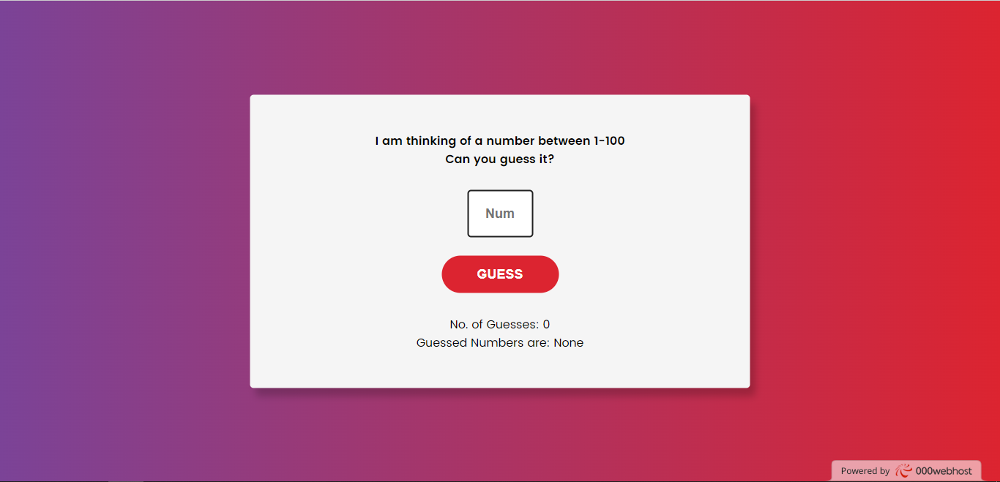

# Number Guessing Game

This is a simple number guessing game built using HTML, CSS, and JavaScript. The game generates a random number between 1 and 100, and the player's task is to guess the correct number. Let's see if you can guess it!

You can try out the live demo of the game [here](https://calnum.000webhostapp.com/NumberGuessing/index.html).

## How to Play

1. Open the game in your web browser.
2. You will see a prompt saying "I am thinking of a number between 1-100. Can you guess it?"
3. Enter your guess in the input field provided.
4. Click the "GUESS" button or press Enter.
5. The game will provide feedback based on your guess:
   - If your guess is too low, it will display "Your guess is too low."
   - If your guess is too high, it will display "Your guess is too high."
   - If your guess is correct, it will display "Yippie! You have Won."
6. The game keeps track of the number of guesses you have made and the guessed numbers.

## How to Contribute

If you would like to contribute to this project, you can follow these steps:

1. Fork the repository.
2. Clone the forked repository to your local machine.
3. Make your desired changes.
4. Commit and push your changes to your forked repository.
5. Create a pull request explaining your changes.

## Development Setup

To set up the project locally, follow these steps:

1. Clone this repository to your local machine.
2. Open the `index.html` file in your web browser.
3. Start playing the game!

## License

This project is licensed under the [MIT License](LICENSE).

Feel free to explore, play the game, and have fun! If you encounter any issues or have suggestions for improvements, please feel free to contribute. Enjoy guessing the numbers!
